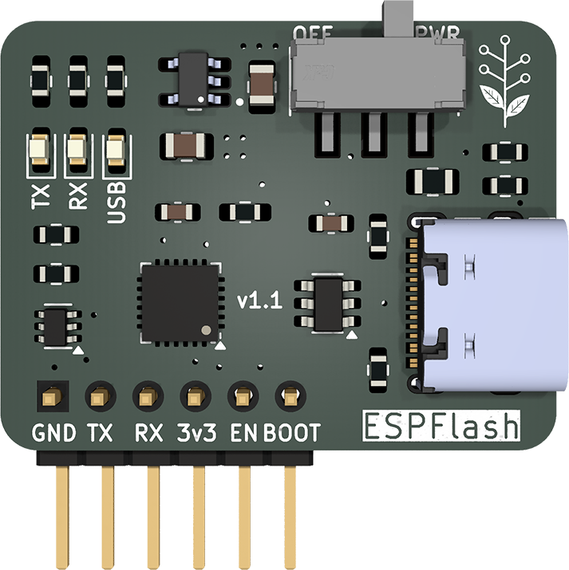

# YAOEF (Yet Another Open ESP Flasher)

## Status:

Prototype. Design complete but not tested in its built form.

## Introduction:

My remix of a simple "dongle" for flashing ESP32 based devices that have the ESPFlash header implemented (per Jon Oxer, SuperHouse. Ref http://superhouse.tv/espflash).

Why build USB capabilities into every ESP32 design when a simple header will suffice? Save on parts count, footprint, BOM, etc. The dongle supports auto-programming logic and a power switch allows it to be used for serial debugging when under circuit power (I.e., turn the switch off to disable USB power to ESPFlash header).

